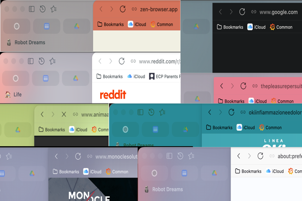

# Blended Addressbar

An addressbar that belongs to the page.

Blended Addressbar is a Zen Browser mod that adds a compact, page-aware browser frame to Zen's dual-toolbar and Only Sidebar layouts. Dual-toolbar layouts also blend the addressbar with the active page.

## Features

- Adaptive addressbar background and foreground colors from active-page semantic colors in dual-toolbar layouts.
- Readability guardrails for adaptive foreground colors.
- Browser window tinting that mixes the active site theme into Zen's existing browser theme instead of replacing it. The tint is optional and configurable by percentage.
- Compact framed browser surface with configurable corner radius, frame gap, padding removal, and selectable shadow strength.
- Split view support that keeps only the outer browser-frame corners rounded while inner split boundaries stay square.
- Compact-mode toolbar icon colors that follow the addressbar foreground.
- Preference-driven loading bar height, opacity, and color source.
- Coalesced active-tab color refreshes using `requestAnimationFrame` plus a timeout fallback, backed by a persistent content sampler and bounded page-color cache.

## Installation

Blended Addressbar is distributed through [Sine](https://github.com/CosmoCreeper/Sine). Install it from Sine, then enable `Blended Addressbar` in Sine settings.

## Compatibility

This mod targets Zen Browser dual-toolbar and Only Sidebar layouts. Only Sidebar keeps Zen's native sidebar addressbar while the frame, window tint, split view, compact mode, and loading bar remain supported. Visual validation is still recommended after Zen updates because browser chrome selectors can change.

## Preferences

The mod exposes its settings through `preferences.json`.

- `uc.blended-addressbar.window-tint.enabled`: tint the browser window with active page colors while preserving Zen's existing icon and text colors.
- `uc.blended-addressbar.window-tint.strength`: tint strength as a percentage from `0` to `100`; defaults to `25`.
- Page colors are always remembered in memory while browsing.
- `uc.blended-addressbar.frame-radius`: outer browser frame corner radius as a CSS length, such as `8px` or `0`.
- `uc.blended-addressbar.frame-radius.disabled`: remove browser frame rounding without changing the configured radius; disabled by default.
- `uc.blended-addressbar.frame-gap`: spacing around the browser frame as a CSS length, such as `5px` or `0`.
- `uc.blended-addressbar.frame-padding.disabled`: remove the browser frame padding around page content.
- `uc.blended-addressbar.addressbar-bookmarks-separator.disabled`: remove the separator between the addressbar and visible bookmarks bar.
- `uc.blended-addressbar.frame-shadow`: choose the browser frame shadow preset: standard, minimal, or medium.
- `uc.loadbar.mode`: choose Default, Progress bar, URL bar glow, or Window edge. Default keeps Zen's native loader; the mod defaults to URL bar glow.
- `uc.loadbar.color`: fallback loadbar color when no page or header color is available.
- `uc.loadbar.focus-color`: use the browser focus color for Progress bar, URL bar glow, and Window edge instead of the header foreground; enabled by default.
- `uc.loadbar.height`: loading bar thickness for all custom loadbar styles.
- `uc.loadbar.opacity`: loading bar body opacity and glow intensity for all custom loadbar styles.
- `uc.loadbar.roundedcorner`: enable right-side rounded corners for Progress bar, URL bar glow, and Window edge.
- `uc.loadbar.shadow`: enable shadow for Progress bar and Window edge.

## Credits

Some performance-oriented ideas in the current sampler were adapted from [caezium/zen-page-tint](https://github.com/caezium/zen-page-tint), especially the `requestAnimationFrame` scheduling pattern, persistent content sampler, and bounded page-color cache.
