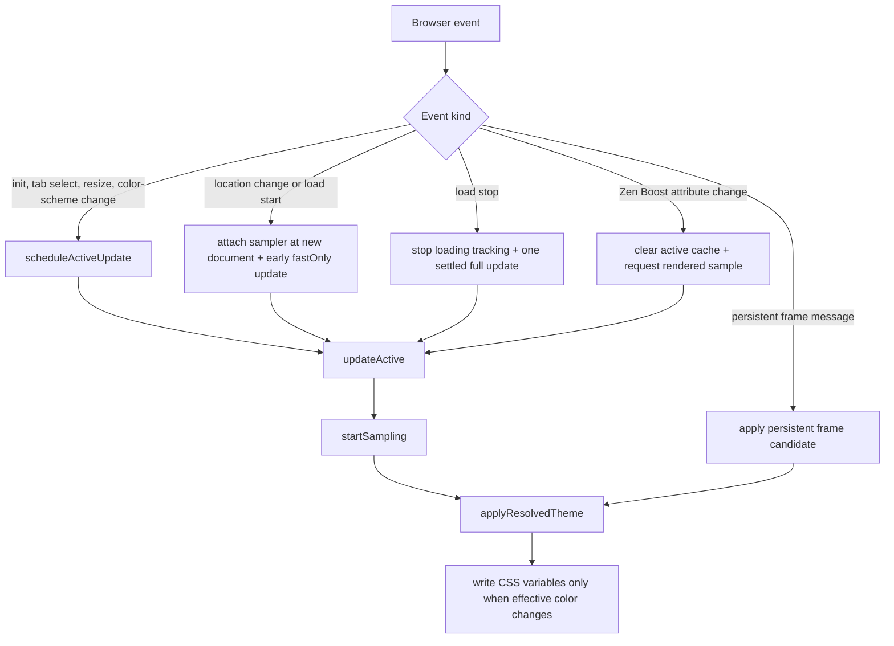
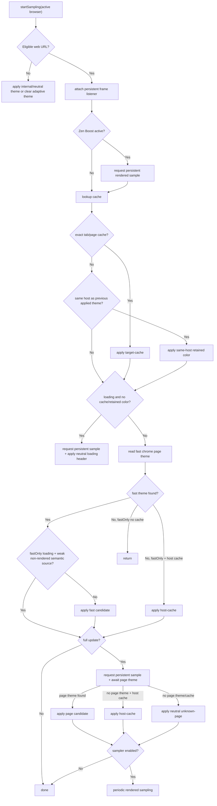
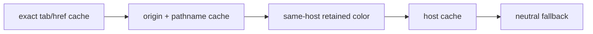

# Adaptive Color Architecture

This document describes the current adaptive color pipeline for Blended Addressbar and a proposed simpler model for future changes.

## Runtime Pieces

- `blended-bar.uc.js` runs in browser chrome. It owns browser lifecycle hooks, cache lookup orchestration, candidate arbitration, CSS variable writes, native Zen tinting, frame preferences, and loading bar preferences. It remains the single Zen script entry point and loads focused helper modules from `scripts/`.
- `scripts/style-state.js` owns idempotent CSS custom property writes/removals.
- `scripts/color-sampling.js` provides a shared alpha-weighted dominant-color calculation. It groups RGB pixels into 4-bit-per-channel buckets and averages only the winning bucket. The persistent frame samples the visible top 8px, downscaled to at most 256px wide; the chrome snapshot fallback applies the same algorithm to an 8px strip.
- `scripts/loadbar.js` owns the monotonic loading-progress calculation. Its estimate timer animates progress only; it never samples page colors.
- `scripts/split-addressbars.js` owns the local address/reload controls. Browser events and frame-message routing stay in the chrome entry point.
- `scripts/color-utils.js` owns color parsing, alpha visibility checks, contrast, and readable foreground selection.
- `scripts/prefs.js` owns preference access and preference value normalization.
- `scripts/pane-layout.js` owns split-pane/browser-frame corner radius observation and updates.
- `scripts/theme-source-policy.js` owns color source policy metadata, confidence lookup, preferred semantic checks, and rendered-source checks.
- `frame.js` runs in page content through a persistent frame listener. Chrome fetches it and `color-sampling.js` once from Sine, then loads both as data URLs into the same message-manager global scope; direct Sine chrome URLs did not initialize the helper in Zen's remote content process. Initialization is marked complete only after setup succeeds. It watches page theme mutations, prefers-color-scheme changes, load, and pageshow events, then sends lightweight color samples back to chrome. Scroll does not trigger color updates.
- `style.css` consumes chrome CSS variables such as `--zen-tab-header-background`, `--zen-tab-header-foreground`, `--blended-addressbar-frame-background`, and `--blended-addressbar-window-tint-background`.
- `styles/header-chrome.css` consumes the header foreground variables for hidden-tabs and compact-mode chrome icon styling.
- `styles/loadbar.css` consumes loadbar variables and preferences.
- `preferences.json` exposes user settings. Exact tab and page colors are remembered in memory while browsing.

## Current Event Flow

Most events converge on `scheduleActiveUpdate`, `updateActive`, and `startSampling`.



## Current Start Sampling Flow



## Color Sources

Source metadata is centralized in `scripts/theme-source-policy.js`; ordering decisions still happen in `startSampling`, `shouldSkipFastLoadingTheme`, and `applyResolvedTheme`. Zen Boost is intentionally not in the source registry because it is a resolve-context modifier, not a color source. This table describes the effective source policy.

| Source | Class | Rendered/trusted? | Confidence | Notes |
| --- | --- | --- | --- | --- |
| `theme-color` | preferred semantic | no | 7 | Preferred semantic fallback during active loads; confirmed top-edge pixels can replace it. Ignored while Boost requires pixel-derived sources. |
| `top-visible` | visual DOM | yes, but not pixel-derived | 6 | Top visible element from chrome-side DOM read or persistent-frame ancestor sampling. Ignored while Boost requires actual pixels. |
| `pixel-top-edge` / `pixel` | visual pixel | yes | 8 | Persistent content or chrome snapshot of rendered top edge. |
| `dark-reader` | modifier-derived visual | yes, but not pixel-derived | 5 | Uses Dark Reader CSS variables. Treated as rendered because it reflects transformed page colors, but ignored while Boost requires actual pixels. |
| `host-cache` | cache fallback | maybe | 4 | Rendered only when its `cachedSource` was rendered; Boost accepts it only when `cachedSource` was pixel-derived. |
| `body` / `html` | weak semantic | no | 3 | Useful fallback, but prone to blink when later visual samples arrive. |
| `document-canvas` | weak semantic | no | 2 | Last document-level fallback before chrome fallback. |
| `sampler` | visual fallback | yes | 1 | Legacy periodic snapshot path. |
| `chrome-contrast-fallback` / `toolbar-fallback` | chrome fallback | no | 1 / 0 | Keeps UI readable when no page signal is available. |

## Loading-time rendered updates

The persistent frame samples after two animation frames on initialization and DOMContentLoaded, with a 100ms safety timeout if animation frames are suspended. While the document is loading and for three seconds after load/pageshow, MozAfterPaint triggers additional samples at most every 32ms (about 30 samples per second), allowing late-rendered page headers to replace an early color. No loading poll or scroll listener is added.

During loading, a newer pixel-derived candidate can replace an older pixel candidate at the same confidence. Lower-confidence semantic candidates still cannot displace confirmed rendered colors. If the frame cannot return pixels, both ordinary active tabs and visible split panes request a coalesced chrome snapshot of the top 8px. Full active-tab updates also request one snapshot independently of frame replies. When scroll offsets are unavailable, the snapshot captures the current viewport at half scale and reads its first four rows, rather than assuming a document offset of zero. Snapshot replies are guarded by request identity, document, URL and current visibility; newer frame messages invalidate older snapshots.

## Split-pane colors

Visible dual-toolbar split panes attach the existing persistent frame sampler. Pixel-derived messages update only the matching pane; if a frame produces a semantic fallback, a chrome snapshot supplies the pane’s rendered color. Snapshot requests are coalesced per browser and discarded when the document, URL or pane membership changes. Each attached frame observes prefers-color-scheme changes independently, including in inactive visible panes. These events force one debounced message even if semantic metadata stays unchanged, so chrome can refresh its rendered fallback. No scroll listener or color polling is added.

Each pane commits its own background and readable foreground together. Its theme is cleared on URL changes and pixel caches are reused when available. The active toolbar keeps the existing arbitration policy. Per-pane controls occupy the native `browserstack` grid cell, with a margin reserving their row above the stack; browser elements keep their original parents. The native URL editor also keeps its parent: pane geometry supplies CSS coordinates while split mode is active. The collapsed original is hidden, and focus or Cmd/Ctrl+L reveals the real editor over the selected field. Resize and layout observers update its anchor; leaving split mode removes the override. Local copy and site-settings buttons select their browser before invoking the native action. A separate split-bars attribute collapses the shared toolbar wrapper and hides bookmarks while the rows exist, including while Glance is focused. The nav bar uses visibility rather than display removal so its native URL editor can remain visible and interactive. Collapsed wrapper containers ignore pointer events; the editor explicitly restores them while open so invisible toolbar boxes cannot cover pane controls. Toolbar and bookmark preferences are never changed.

## Cache Layers

- `themeCache`: per-browser `WeakMap` for the current exact tab and href.
- `pageThemeCache`: bounded in-memory cache by origin and pathname. This is the preferred tab-switch fallback after exact tab cache.
- Same-host retention: if the next tab has the same host as the last applied theme, the previous theme can be retained briefly instead of flashing neutral while an unloaded tab restores.

On tab switch, an exact color cached for the selected browser and URL applies immediately, then a fresh sample can correct it. Broader page and same-host colors remain delayed fallbacks. Cache precedence is:



## Modifiers And Special Cases

Modifiers change which candidates are trusted and how quickly they can commit.

| Modifier | Current behavior |
| --- | --- |
| Loading | Marks active load state and attaches the persistent frame when the new top-level document commits, then schedules an early `fastOnly` update and one settled update at load stop. Attaching at location change avoids binding the frame script to the previous document during `STATE_START`. The frame handles follow-up paint and `load`/`pageshow` samples. Neutral loading color is used only when no cache or retained color exists. Weak semantic fast colors are skipped during active loading, except preferred `theme-color`. |
| Tab switch | Applies the exact selected tab and URL color immediately, then requests fresh page pixels. Broader page and same-host colors remain delayed fallbacks. Loaded tabs use no color transition; only color changes during active loading retain the 100–180ms transition. Equivalent color keys are no-ops to avoid needless chrome writes. |
| Zen Boost | Detected through `#zen-site-data-icon-button[boosting]` in `blended-bar.uc.js`, then folded into `createResolveContext` as `boostActive`, `requireRendered`, and `requirePixel`. Boost changes clear active page cache, request a persistent rendered sample, and require pixel-derived sources such as `pixel-top-edge`, `pixel`, `sampler`, or host cache entries from those sources. Computed-style sources such as `top-visible`, `body`, `html`, and `theme-color` are ignored while Boost is active. |
| Dark Reader | Detected through `--darkreader-neutral-background` and `--darkreader-neutral-text`. Treated as rendered for normal arbitration, but rejected when Boost requires actual pixels. |
| Persistent frame | Sends top-edge pixel, theme-color, body/html, or ancestor top-visible samples when the page loads, mutates theme attributes/head metadata, or fires pageshow/load. It does not listen to scroll events. |
| Foreground stability | Background and foreground are applied together. Early candidates can reuse a stable readable foreground to avoid addressbar text blinking before samples catch up. |
| Native window tint | Applies a mixed page color to Zen background variables without replacing Zen's primary/text variables. |

## Why Disturbing Changes Still Happen

Most visible blink comes from one of these transitions:

1. A neutral loading fallback is painted before a useful cache or page signal exists.
2. A broad host cache paints first, then exact page or rendered sample replaces it.
3. A weak semantic source, such as `body` or `html`, paints before a rendered top-edge source.
4. Boost changes the actual rendered page colors after earlier semantic values were cached.
5. Foreground contrast is recomputed after the background has already changed.
6. A fresh tab-switch sample replaces a cached color with a current rendered top-edge color.

Current mitigations exist for each case, but they are spread across scheduling, cache lookup, source confidence, source rendered checks, and CSS no-op checks.

## Implemented Simplification

The first refactor phase is implemented across `blended-bar.uc.js` and the helper modules:

- Color source metadata now lives in `scripts/theme-source-policy.js`.
- `isRenderedThemeSource`, `isPreferredSemanticThemeSource`, and `getThemeSourceConfidence` read from the same registry.
- `isPixelThemeSource` keeps Zen Boost resolution on actual pixel samples instead of computed-style color sources.
- `createResolveContext` centralizes loading, Boost, stable-delay, and pending-candidate inputs before arbitration.
- Fast loading semantic skips now use `shouldSkipFastLoadingTheme` instead of duplicating the condition inline.
- Cached tab switches can now return after successfully painting the cached/retained color, avoiding an immediate persistent-frame sample on switch while still continuing if the cached candidate is rejected.
- Navigation no longer runs a repeating loading poll loop; active loads use one coalesced early update, one settled update, and persistent-frame `load`/`pageshow` refreshes.
- Repeated CSS property writes use `scripts/style-state.js` so equivalent values are no-ops.
- Hidden-tabs chrome foreground styling now lives in `styles/header-chrome.css`, imported by `style.css`.

The larger pipeline split below is still proposed.

## Proposed Simpler Model

The code would be easier to reason about if it used three explicit stages:

1. **Collect candidates.** Gather all available color candidates from cache, semantic DOM, rendered pixels, modifiers, and chrome fallback without deciding yet.
2. **Resolve one color state.** Apply a single policy matrix using context such as phase, loading, tab switch, Boost, cache exactness, and source class.
3. **Commit only meaningful changes.** Write CSS variables only when the final `ColorState` actually differs enough to matter.

### Candidate Shape

Use one internal representation for every source:

```js
{
  bg,
  fg,
  href,
  source,
  sourceClass,   // explicit, semantic, visual, cache, fallback
  rendered,      // true when it reflects post-modifier pixels or equivalent
  exactness,     // exact-tab, exact-page, same-host, host, none
  confidence,
  timestamp,
  modifiers     // boost, dark-reader, color-scheme, loading, tab-switch
}
```

### Resolver Policy

The resolver can then be a small policy matrix instead of scattered booleans:

| Context | Preferred behavior |
| --- | --- |
| Tab switch with exact cache | Paint exact tab/page cache immediately and do not force a fresh sample in the same switch turn. |
| Tab switch same host, no exact cache | Retain previous same-host visual color and do not force a fresh sample in the same switch turn. |
| Loading, no cache | Prefer `theme-color`, `dark-reader`, or rendered visual source. Avoid neutral unless no useful candidate exists. |
| Loading with weak semantic source | Defer or ignore `body`, `html`, and `document-canvas` until stable. |
| Boost active | Rendered-only mode: accept visual pixel/top-visible/Dark Reader/rendered cache; reject non-rendered semantic and broad host fallbacks. |
| Settled page | Allow semantic preferred sources and rendered sources, but use hysteresis so small or lower-confidence changes do not disturb the UI. |
| Scroll/sticky header | Do not update the adaptive header from scroll alone. Keep the previous color until load, pageshow, metadata/theme mutation, Boost, or navigation changes the candidate set. |

### Remaining Simplification Targets

- Finish replacing separate `fastOnly`, `deferNonVisual`, `requireRendered`, `skipToolbarFallback`, and `loading` checks with one resolver that consumes the existing `ResolveContext`.
- Expand the existing source registry if new sources are added:

```js
const COLOR_SOURCES = {
  'theme-color': { sourceClass: 'semantic', rendered: false, confidence: 7, preferred: true },
  'pixel-top-edge': { sourceClass: 'visual', rendered: true, confidence: 8 },
  'dark-reader': { sourceClass: 'visual', rendered: true, confidence: 5, modifier: true }
};
```

- Treat Dark Reader, Boost, loading, and tab restore as modifiers on the resolve context, not as separate ad hoc branches.
- Keep the persistent frame as the primary dynamic signal. Use chrome snapshot sampling only as a fallback when the frame script cannot produce a rendered candidate.
- Commit a single `ColorState` containing background, foreground, frame tint, source metadata, and href. This reduces foreground/background mismatch risk.
- Add hysteresis: do not replace a visible color with a lower-confidence or near-identical candidate unless the page, source class, or modifier state changed.

## Recommended Next Step

Continue the larger pipeline split in two phases:

1. Add a candidate collection layer while keeping the existing behavior and source registry.
2. Replace the branch-heavy `startSampling`/`applyResolvedTheme` interaction with `collectCandidates -> resolveColorState -> commitColorState`.

This keeps the current performance wins while making future cases, such as Boost, Dark Reader, semantic theme colors, and tab restore, explicit policy choices instead of one-off guards.
